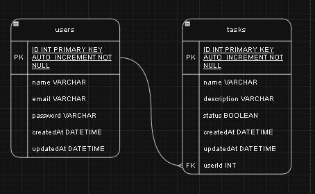

### Uso de dependencias
- express: Framework web para Node.js.
- @types/express: Definiciones de tipos para Express.
- sequelize: ORM para Node.js.
- sequelize-typescript: Decoradores de TypeScript para Sequelize.
- @types/sequelize: Definiciones de tipos para Sequelize.
- typescript: Lenguaje de programación que añade tipado estático a JavaScript.
- mysql2: Driver de MySQL para Node.js.
- nodemon: Herramienta para reiniciar automáticamente la aplicación cuando se detectan cambios.
- ts-node: Ejecuta TypeScript directamente en Node.js.
- @types/node: Definiciones de tipos para Node.js.
- tsyringe: Contenedor de inyección de dependencias para TypeScript.
- bcrypt: Librería para cifrar y verificar contraseñas.
- @types/bcrypt: Definiciones de tipos para bcrypt.
- jsonwebtoken: Librería para crear y verificar tokens JWT.
- @types/jsonwebtoken: Definiciones de tipos para jsonwebtoken.

### Comandos de instalacion 

## Dependencias de producion
```text
npm install @types/bcrypt@^5.0.2 @types/express@^4.17.21 @types/jsonwebtoken@^9.0.6 bcrypt@^5.1.1 express@^4.19.2 jsonwebtoken@^9.0.2 mysql2@^3.11.0 sequelize@^6.37.3 sequelize-typescript@^2.1.6 trying@file: tsyringe@^4.8.0
```

## Dependencias de desarrollo

```text
npm install --save-dev @types/node@^22.1.0 @types/sequelize@^4.28.20 nodemon@^3.1.4 ts-node@^10.9.2 typescript@^5.5.4
```

### Estructura de proyecto 
-  estructura de proyecto modular o estructura de proyecto en capas. Este enfoque organiza el código por funcionalidad y responsabilidades, lo que facilita el mantenimiento, la escalabilidad y la comprensión del proyecto

```text
PROYECTOFINALNODEJS/
├── src/
│ ├── config/
│ │ └── container.ts
│ │ └── db.ts
│ ├── controllers/
│ │ ├── authController.ts
│ │ ├── taskController.ts
│ │ └── userController.ts
| | └── ...
│ ├── middlewares/
│ │ ├── authMiddleware.ts
│ │ └── errorMiddleware.ts
| | └── ...
│ ├── models/
│ │ ├── index.ts
│ │ ├── task.ts
│ │ └── user.ts
| | └── ...
│ ├── repositories/
│ │ ├── taskRepository.ts
│ │ └── userRepository.ts
| | └── ...
│ ├── routes/
│ │ ├── authRoutes.ts
│ │ ├── index.ts
│ │ ├── Router.ts
│ │ ├── taskRoutes.ts
│ │ └── userRoutes.ts
| | └── ...
│ ├── services/
│ │ ├── taskService.ts
│ │ └── userService.ts
| | └── ...
│ ├── types/
│ │ └── express.d.ts
| | └── ...
│ └── index.ts
├── testEnpoints/
│ ├── taskEnpoints.txt
│ └── userEnpoints.txt
| └── ...
├── .gitignore/
├── package-lock.json
├── package.json
├── node_modules/
├── README.md/
└── nodemon.json
```

# nodemon.json config
```text
{
    "watch": [
        "src"
    ],
    "ext": "ts",
    "exec": "ts-node ./src/index.ts"
}
```

# packgage.json scripts
```text
 "scripts": {
    "start": "nodemon"
  },
```

# Compiler options 

```text
{
    "compilerOptions": {
      "target": "ES2020",
      "module": "commonjs",
      "strict": true,
      "esModuleInterop": true,
      "skipLibCheck": true,
      "forceConsistentCasingInFileNames": true,
      "experimentalDecorators": true,
      "emitDecoratorMetadata": true,
      "typeRoots": [
      "./node_modules/@types",
      "./src/types"
      ]
    },
    "include": ["src"]
}
```

## Configuración de compilador para TypeScript


- ***"target": "ES2020"***
- indica que el código TypeScript se debe compilar a JavaScript compatible con la versión ECMAScript 2020.

- ***"module": "commonjs"***
- configura TypeScript para compilar el código a un formato de módulos CommonJS, que es el sistema de módulos utilizado por Node.js. Esto permite que los archivos JavaScript resultantes puedan importar y exportar módulos usando require y module.exports.

- ***"strict": true***
-  TypeScript hace que el compilador sea más riguroso en las comprobaciones de tipos.
    - ***EJ:*** 
    ```text
        function add(a: number, b: number) {
        return a + b;
        }

        add(5, "10"); // Error: Argument of type 'string' is not assignable to parameter of type 'number'.
    ```

- ***"esModuleInterop": true***
-  permite importar módulos CommonJS (como los de require) usando la sintaxis de módulos ES (como import)
    - ***EJ:***
    ```text
        En false 
        import * as fs from 'fs';
        En true
        import fs from 'fs';
    ```

- ***"skipLibCheck": true***
- desactiva la verificación de tipos en los archivos de definición de tipos (.d.ts) de las bibliotecas. Esto acelera la compilación, pero puede omitir errores de tipo en las bibliotecas externas.

- ***"forceConsistentCasingInFileNames": true***
- asegura que todos los nombres de archivos sean consistentes en cuanto a mayúsculas y minúsculas en todo el proyecto

- ***"experimentalDecorators": true***
- permite usar decoradores en TypeScript, que son una forma de agregar metadatos o modificar el comportamiento de clases y propiedades

-  ***"emitDecoratorMetadata": true***
- Genera metadatos para los decoradores. por ejemplo (como en tsyringe para inyección de dependencias) porque permite que las bibliotecas que usan decoradores obtengan información adicional sobre los tipos en el código.

- En resumen: Extender la interfaz Request en Express con user permite añadir y acceder fácilmente a la información del usuario autenticado en cualquier parte de la aplicación, como en middlewares y rutas. Esto facilita la autenticación y autorización, ya que puedo guardar la información del usuario en req.user después de que se haya autenticado, y luego acceder a ella sin necesidad de buscarla de nuevo.

    - ***"typeRoots":*** Esta opción especifica las ubicaciones donde TypeScript debe buscar los tipos.
    - ***"./node_modules/@types":*** Es el directorio predeterminado para los tipos de npm.
    - ***"./src/types":*** Es una carpeta personalizada para usar tipos específicos del proyecto.

# Flujo de datos
```text
https://app.diagrams.net/#G16Y8i_1eVWklnAM-60orrHMjOj5S0gkEQ#%7B"pageId"%3A"6lZxm9y4vlRnIbbWcTSw"%7D
```

- Cliente
    -  |
    -   | HTTP Request (e.g., POST /api/register)
    -   v
- index.ts 

- El punto de entrada de la aplicación. Configura el servidor Express y el enrutador principal.
    - |
- Routes (Router)
    - |
    - | directs to AuthController
    - v
- AuthController
    - |
    - | calls UserService.createUser()
    - v
- UserService
    - |
    - | calls UserRepository.saveUser()
    - v
- UserRepository
    - |
    - | uses User Model to interact with database
    - v
- User Model (defines structure and ORM)
    - |
    - | interacts with database
    - v
- Database
    - |
    - | stores/retrieves data
    - v
- UserRepository
    - |
    - | returns result to UserService
    - v
- UserService
    - |
    - | returns result to AuthController
    - v
- AuthController
    - |
    - | sends response to Router
    - v
- Routes (Router)
    - |
    - | responds to Client
    - v
- Cliente

### Resumen de flujo 
- Router dirige la solicitud al Controller.
- Controller utiliza Service para manejar la lógica de negocio.
- Service interactúa con Repository para operaciones con la base de datos.
- Repository utiliza Model para realizar operaciones en la base de datos.
- Model define cómo se estructuran y manipulan los datos.
- Repository devuelve los resultados a Service, que luego se pasa al Controller.
- Controller envía la respuesta final al Router, que la envía al Cliente.


# Entidad relacion de bd

